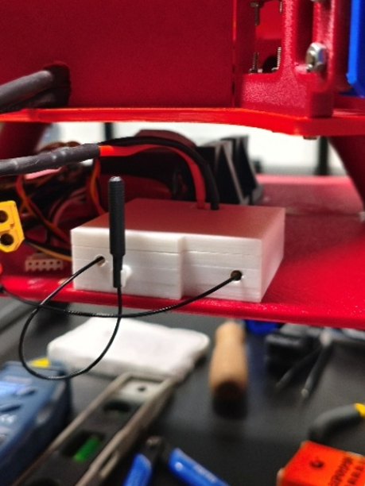
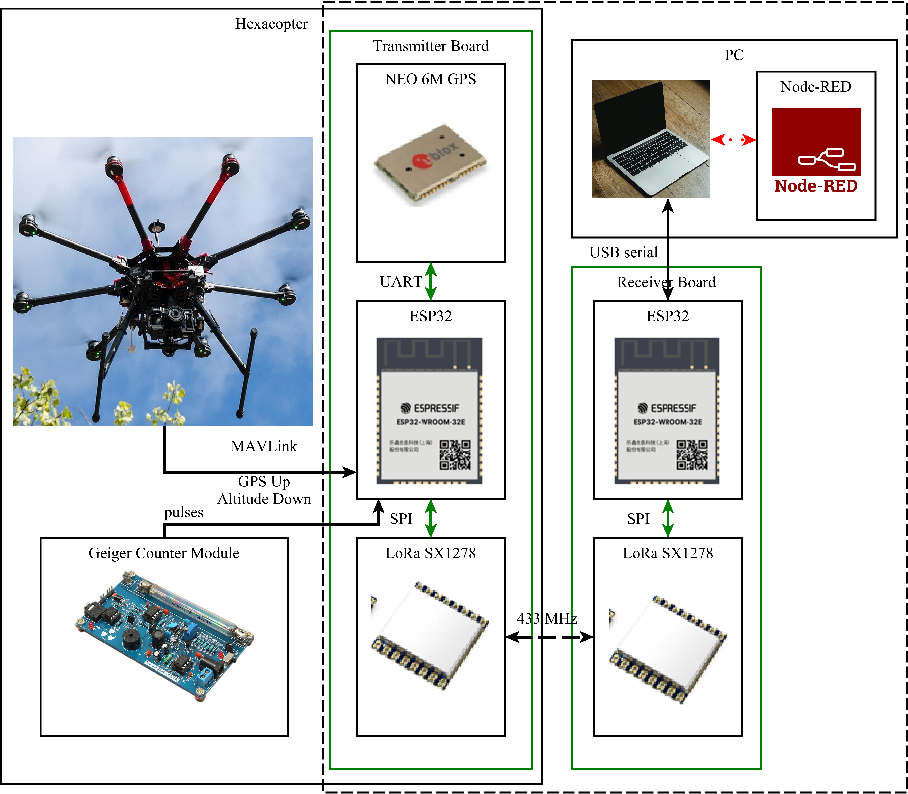
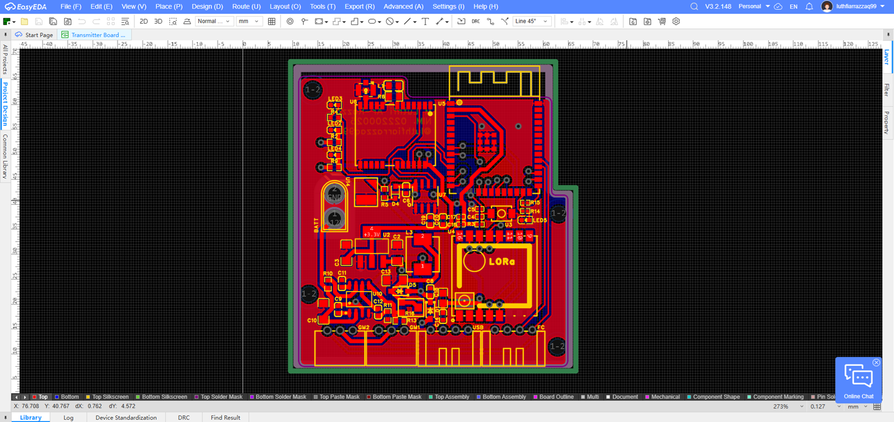
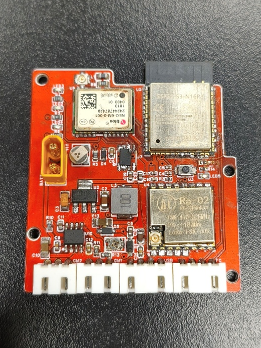
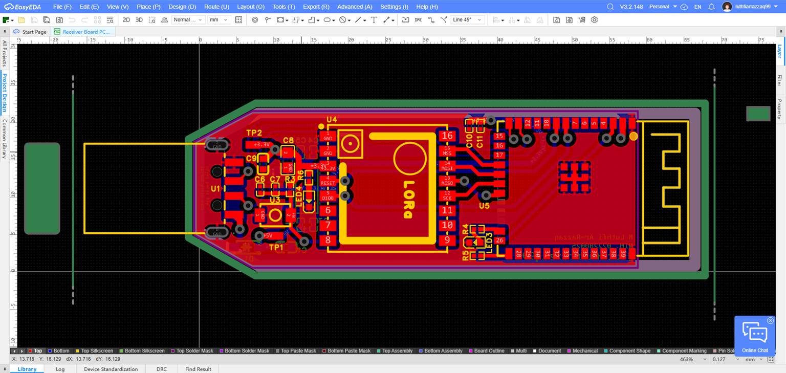
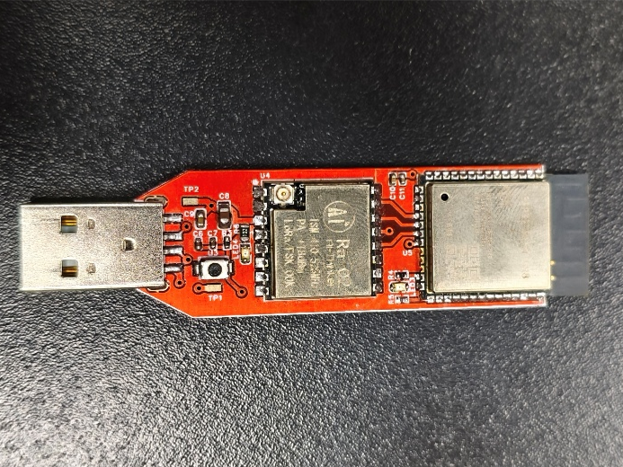
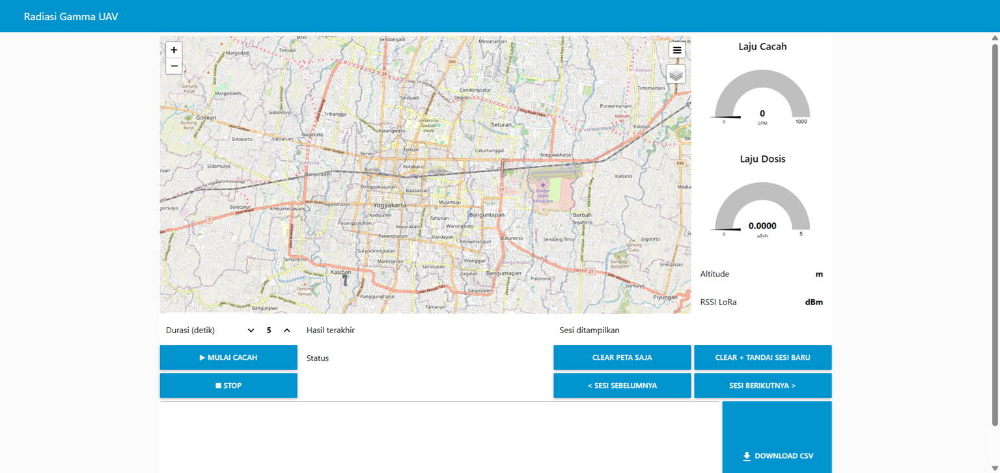
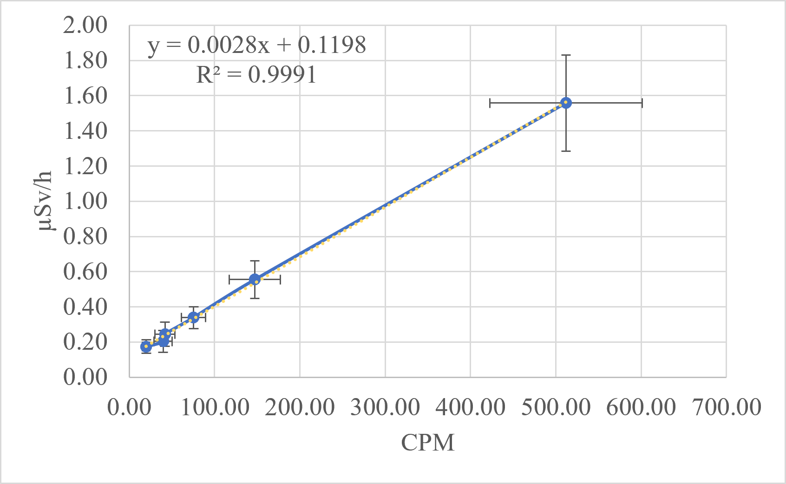
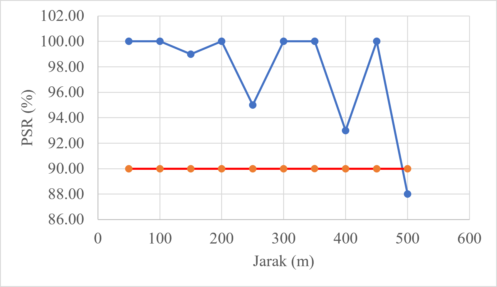
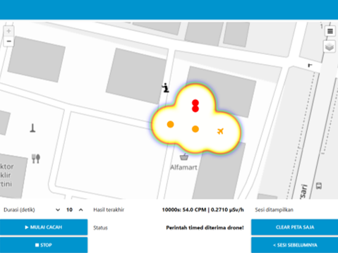

# Airborne Gamma Radiation Detection System

A UAV-mounted gamma radiation detector built on two custom PCBs, an ESP32-S3, and a LoRa
telemetry link — calibrated against a nationally certified reference instrument and validated
to IEC 60846-1.

Built as my final project (*Tugas Akhir*) for the D4 Electronics & Instrumentation program at
Politeknik Teknologi Nuklir Indonesia. Defended 8 July 2026.

<!-- ▸ REPLACE: photo of the transmitter board mounted on the hexacopter -->


---

## The problem

Locating a lost or orphaned radioactive source means sending a person toward an unknown
radiation field. The search is slow, and the searcher takes the dose.

This system moves the detector onto a hexacopter. An operator flies a grid, watches count rate
and position stream back over LoRa in real time, and narrows down the source location without
anyone approaching it. Because the radio link is point-to-point, it needs no cellular or Wi-Fi
infrastructure — which is exactly the condition you find at an emergency site.

## What it does

| | |
|---|---|
| **Detects** | Gamma radiation via a Geiger-Müller tube (J305), interrupt-driven pulse counting |
| **Locates** | On-board u-blox NEO-6M GPS, plus relative altitude read from the flight controller over MAVLink |
| **Transmits** | LoRa SX1278 at 433 MHz, point-to-point, no network infrastructure required |
| **Displays** | Node-RED ground station — live gauge, interactive map, heatmap, SQLite session logging |
| **Measures** | Calibrated to 0.0028 µSv/h per CPM against a BAPETEN/KAN-certified reference (R² = 0.9991) |

---

## System architecture

<!-- ▸ REPLACE: Gambar 3.2 from the thesis (system architecture diagram) -->


```
┌──────────────────────── HEXACOPTER ────────────────────────┐
│  ┌────────────┐   pulses   ┌──────────────┐                │
│  │ GM tube    │───────────▶│              │                │
│  │ J305       │            │  ESP32-S3    │   SPI   ┌────┐ │
│  └────────────┘            │  transmitter │────────▶│LoRa│ │
│  ┌────────────┐   UART     │              │         │RA-02││
│  │ NEO-6M GPS │───────────▶│  state       │         └──┬─┘ │
│  └────────────┘            │  machine     │            │   │
│  ┌────────────┐  MAVLink   │              │            │   │
│  │ Flight ctl │◀──────────▶│              │            │   │
│  └────────────┘  GPS up /  └──────────────┘            │   │
│                  alt down                              │   │
└────────────────────────────────────────────────────────┼───┘
                                                433 MHz │
                                                        ▼
                          ┌──────────────┐        ┌──────────┐
                          │ Node-RED     │◀───────│ ESP32-S3 │
                          │ + SQLite     │  USB   │ receiver │
                          │ ground stn   │ serial │ (dongle) │
                          └──────────────┘        └──────────┘
```

---

## Hardware

Both boards were designed from scratch in EasyEDA, fabricated, and hand-assembled.

### Transmitter board

<!-- ▸ REPLACE: Gambar 4.4 (PCB layout) and Gambar 4.5 (photo, top + bottom) -->
<p align="center">
  
  
</p>

| Specification | Detail |
|---|---|
| Microcontroller | ESP32-S3-N16R8 |
| Radio | RA-02 (SX1278), 433 MHz |
| Radiation sensor | Geiger counter module, J305 tube |
| Position sensor | u-blox NEO-6M |
| Flight controller interface | UART, MAVLink, 115200 bps |
| Power input | Hexacopter 12 V LiPo |

**Layout decisions and why:**

- **SPI signal routing separated from power routing** — the LoRa module's SPI lines are
  susceptible to coupled noise from the switching supply, and a corrupted SPI transaction
  silently drops telemetry packets.
- **LoRa antenna placed at the board edge** — keeping it clear of copper pour and tall
  components preserves the radiation pattern; an obstructed antenna costs range directly.
- **Geiger module high-voltage section physically isolated from the MCU** — the tube runs at
  several hundred volts. Isolation is a safety requirement first and an EMI measure second.
- **Compact form factor** — every gram on a hexacopter is flight time.

### Receiver board

<!-- ▸ REPLACE: Gambar 4.7 (layout) and Gambar 4.8 (photo) -->
<p align="center">
  
  
</p>

| Specification | Detail |
|---|---|
| Microcontroller | ESP32-S3-N16R8 |
| Radio | RA-02 (SX1278), 433 MHz |
| Host interface | USB Type-A, serial 115200 bps |
| Power | USB bus, 5 V |
| Regulation | AMS1117, 3.3 V |
| Indicator | On-board LED (IO48) |
| Form factor | USB dongle |

---

## Firmware

Written in C++ for the ESP32-S3.

**Transmitter — two-layer state machine:**

- **Continuous mode** — transmits every 2 s for real-time monitoring during a flight.
- **Timed Count mode** — fixed-duration counting for measurements that need a defined
  integration window.
- **1 s listen window after every transmission** — gives the operator a bidirectional command
  channel without transmit collisions, on a protocol that is otherwise one-way by habit.
- **Interrupt-driven pulse counting** — an ISR captures every GM tube pulse, so counts are not
  lost to main-loop latency during radio transmission or GPS parsing.
- **MAVLink integration** — uplinks GPS position to the flight controller and reads back
  relative altitude, with automatic fallback to the on-board GPS altitude if the flight
  controller link drops.

**Receiver:** forwards operator commands with automatic retry, and streams received frames to
the host over USB serial.

```
firmware/
├── transmitter/
│   └── src/main.cpp    # state machine, ISR pulse counting, LoRa, GPS, MAVLink
└── receiver/
    └── src/main.cpp    # RX, CRC validation, retry logic, JSON over USB serial
```

Both files carry a `KNOWN ISSUES` block in their header listing defects found during
review — including a state-machine path that makes a mid-count STOP command unreachable, and
missing `volatile` on two ISR-shared variables. They are documented rather than patched so
this code matches exactly the build that produced the results above.

---

## Ground station

Node-RED flow with live gauge, interactive map, heatmap overlay, session management, and
logging to a local SQLite database.

<!-- ▸ REPLACE: Gambar 4.15 (Node-RED dashboard screenshot) -->


Import `ground-station/flows.json` into Node-RED and install the dependencies listed in
`ground-station/README.md`.

---

## Calibration and measurement uncertainty

This is the part that determines whether the numbers mean anything.

The system was calibrated against a **BAPETEN/KAN-certified reference survey meter** using a
Cs-137 source at six measured distances, with background count rate subtracted.

<!-- ▸ REPLACE: Gambar 4.18 (scatter plot with trendline and error bars) -->


**Linear regression, net CPM vs corrected reference dose rate:**

| Parameter | Value |
|---|---|
| Conversion factor (slope) | **0.0028 µSv/h per CPM** |
| Intercept | 0.1198 µSv/h |
| Coefficient of determination | **R² = 0.9991** |

**Validation against the reference:**

- 5 of 6 distance points met the δ ≤ 10 % deviation criterion
- Mean deviation **3.89 %**
- Worst case 13.63 % at 50 cm — attributable to a low count rate approaching the minimum
  detectable dose rate (MDDR), where counting statistics dominate

**Uncertainty budget** (Type A from repeated measurements, Type B from instrument and geometry
contributions):

| Quantity | Value |
|---|---|
| Expanded uncertainty (k = 2) | **22.19 %** |
| IEC 60846-1 limit | ≤ 30 % |
| Dominant contributor | Intrinsic limitation of the reference instrument |

The budget passes, and the largest term is a property of the reference rather than of this
system — which is the honest reading of the result.

Raw calibration data and the uncertainty workbook are in `calibration/`.

---

## LoRa link characterization

Configuration: **SF10, BW 125 kHz, CR 4/8, 20 dBm**, line of sight, ground-level test.

<!-- ▸ REPLACE: Gambar 4.21 (PSR vs distance) -->


| Result | |
|---|---|
| Packet success rate | **≥ 95 % consistently to 350 m** |
| Statistical test | Binomial proportion test, H₀: PSR ≤ 90 % |
| H₀ rejected | 50 m – 350 m (all points) |
| H₀ not rejected | 400 m, 500 m |
| **Effective range** | **350 m** |

The original hypothesis was 10–500 m. It did not hold, and the honest conclusion is a 350 m
effective range. RSSI and SNR versus distance are in `docs/lora-results.md`.

### Motor interference

Brushless motors are electrically noisy and sit centimetres from the detector. Tested at 25 %
throttle with the airframe tethered (free-hover loiter was not achievable within the project's
technical constraints), at 1 m height.

A two-sample t-test found **statistically significant differences in both count rate and RSSI**
between motors-off and motors-on (p < 0.05) — evidence of electronic interference from the
brushless motors. Because the test was tethered rather than in free hover, this indicates the
effect without generalizing to flight conditions.

---

## Field test — locating a concealed source

A 2 × 2 grid at 10 m spacing, 10 s dwell per point, constrained by drone battery endurance.

<!-- ▸ REPLACE: Gambar 4.25 (heatmap in Node-RED) -->


The grid point with the highest count rate was **1.76 m from the source's actual position**,
validating that the system can estimate source location from the air.

---

## Repository structure

```
.
├── hardware/
│   ├── transmitter/        # EasyEDA project, schematic + layout, gerbers, BOM
│   └── receiver/           # EasyEDA project, schematic + layout, gerbers, BOM
├── firmware/
│   ├── transmitter/
│   └── receiver/
├── ground-station/         # Node-RED flows, SQLite schema
├── calibration/            # raw data, regression, uncertainty budget
├── docs/
│   ├── images/
│   └── lora-results.md
└── README.md
```

---

## Limitations

Stated plainly, because they matter more than the successes:

- Effective radio range is 350 m, not the 500 m originally hypothesized.
- Motor interference was characterized on a tethered airframe, not in free hover. The effect is
  real; its magnitude in flight is not established.
- The search grid was 2 × 2 at 10 m spacing — constrained by battery endurance, not by the
  detection method.
- At low count rates near the MDDR, deviation from the reference exceeds 10 %.

## Possible extensions

- Higher-sensitivity scintillation detector to reduce dwell time per grid point
- Automated grid flight planning rather than manual piloting
- Shielding or physical separation between motors and detector, re-tested in free hover
- Multi-source discrimination

---

## Author

**Muhammad Luthfi Ar-Razzaq**
D4 Electronics & Instrumentation, Politeknik Teknologi Nuklir Indonesia (BRIN)
<!-- ▸ REPLACE with your real links -->
[LinkedIn](https://www.linkedin.com/in/lutfhi-arrazzaq-5a421a362) · luthfiarrazzaq99@gmail.com

Supervised by Prof. Dr. Anhar R. Antariksawan and Halim Hamadi, M.Sc.
Defended 8 July 2026.

## License

<!-- ▸ Pick one. MIT is the usual default for a portfolio project. -->
MIT — see [LICENSE](LICENSE).
